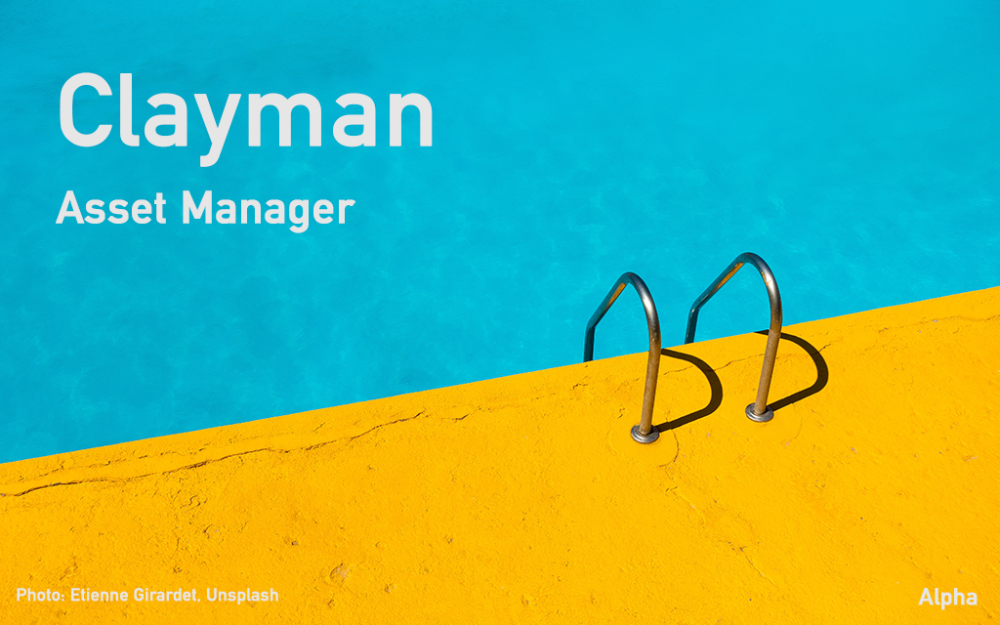

**Welcome to the offical repository of the famous Clayman Manager.**

Clayman is a modern asset manager browser system designed to help users to keep assets tidy and searchable. It aims to be fast and responsive even with a hight number of assets in the Library.

Download links: **Win** / **Linux** / **Mac**

Application support:
 - **Clarisse iFX 5.0 sp7b+ Python 3.7**
 - **Clarisse iFX 4.0 sp17 Python 2.7**

#### Clayman Asset Manager:

  - Standalone libraries driven by user configuration or environment variables
  - Library creation and loading, library history
  - Drag and drop to Import new Asset
  - Import, Export and Delete Asset Packages
  - Duplicate and Variants support WIP
  - LibraryEngine v1.0 Python API for integrations in DCC (not in Alpha)
  - Creation of Categories and QuickTags and Search filters 
  - Fast search by any keyword including names, tags, asset info data
  - Assets thumbnail and previews (images, video mp4 support)
  - Asset Editor v1.0 to edit an Asset Package
  - Threaded actions where available with Job Que v1.0 (import archive , export archive, delete, duplicate, variant)
  - Customizable Asset Manager UI (add or remove UI elements to fit mixed workflows) with shortcuts
  - Contextual menu items and Action shortcuts
  - User Python Plugins v1.0 support and loading (as Right click on package)
  - Dockable Workspace UI layouts, Custom Dockable Workspace UI layouts, Predefined Workspace layouts
  - Customizable splash screen, random Unsplash surprises

#### Clayman Asset Import:

  - Asset import User interface
  - Copy Assets to Library (direct copt to the Library)
  - Link assets in the Packakge (no copy to Library, reference already existing location)
  - Asset Tagging and Asset Description
  - Fast Dominant Color Extraction (dominant colors)
  - Image Conversion (limited support)
  - Support for Asset types:
    - Surface, Geometry, Light, Volume, Brush, Preset, Project, File, Video, Sequence
    - Detection of imported asset types and properties per Type
  - Automatic texture conversion to various formats (not in Alpha)
  - Asset Package v1.0

#### Clayman Application Support:

  - AppDiscovery Engine v1.0, supported application loading
  - Clarisse 4.0 and Clarisse 5.0 integration with Asset importing, Asset export to library WIP
  - Packages type filter per application
  - Full Clayman inside your host app
  - Side application launching (DJV, Photoshop, Nuke, Houdini etc... WIP)
  
 
  
**Development status:** Alpha > Beta

**Platforms**: Win / Linux / Mac

**Python**: Python 3.7

### Support or Contact

Having trouble with Clayman? Check out our [documentation](https://www.clayman.app/help) or [contact support](https://www.clayman.app/support)

  ---
Copyright 2022 All rights reserved. Obrt Dobro, Aleks Katunar, Žabica 1, 51000 Rijeka, Croatia, Europe, Earth, Milky way
